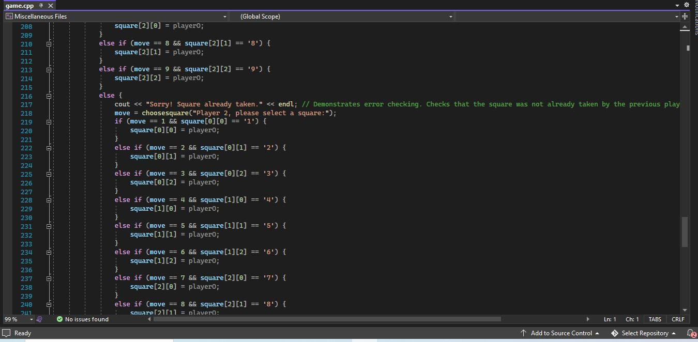
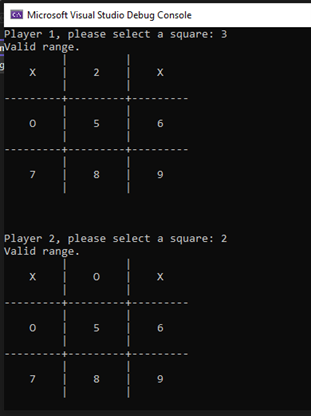

# Week 11 - Array/Pointer Program

For this programming assignment, I modified the tic-tac-toe board from Week 9. I corrected any previous errors and created a two-dimensional 3x3 array to hold the contents of each of the 9 squares on the game board. The values displayed are generated from the values in this array. I also incorporated loops whenever possible to make the code more efficient and easy to read. The goal was to reduce any redundant code and make the game code concise and effective.

* Tic-Tac-Toe Code

* Running the Code

