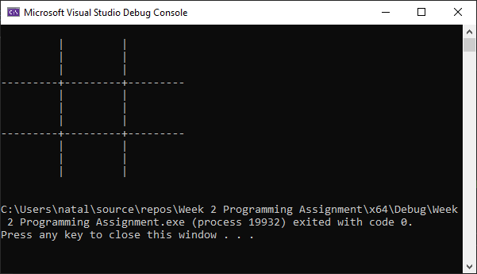

# Programming Project Week 2

For this week, I completed two programming projects in C++. The first project was creating a blank tic-tac-toe board. The second project was creating a simple calculator and performing mathematical operations. For this simple calculator, I inputted the values 17 and 5 for the mathematical operation. 

# Tic-Tac-Toe Program

* This shows the code to create the Tic-Tac-Toe Board.

* This is the output after successfully running the code.

# Simple Calculator

* This shows the code to create the simple calculator.

* This is the output after successfully running the code and inputting the numbers 17 and 5.

