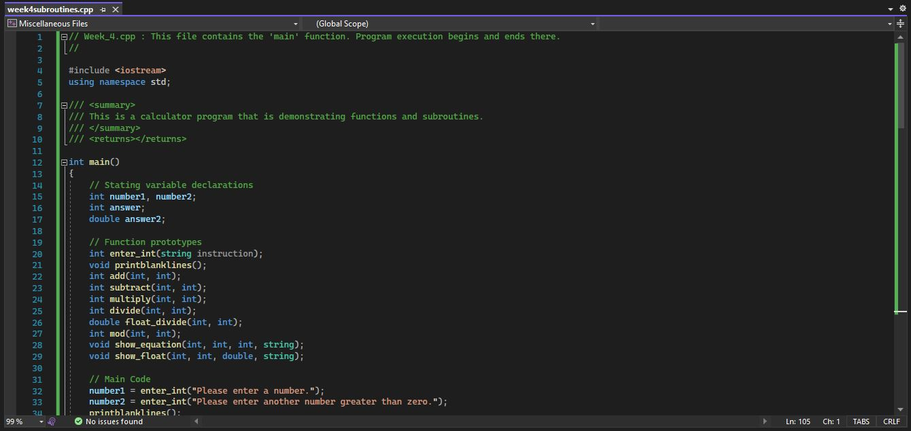
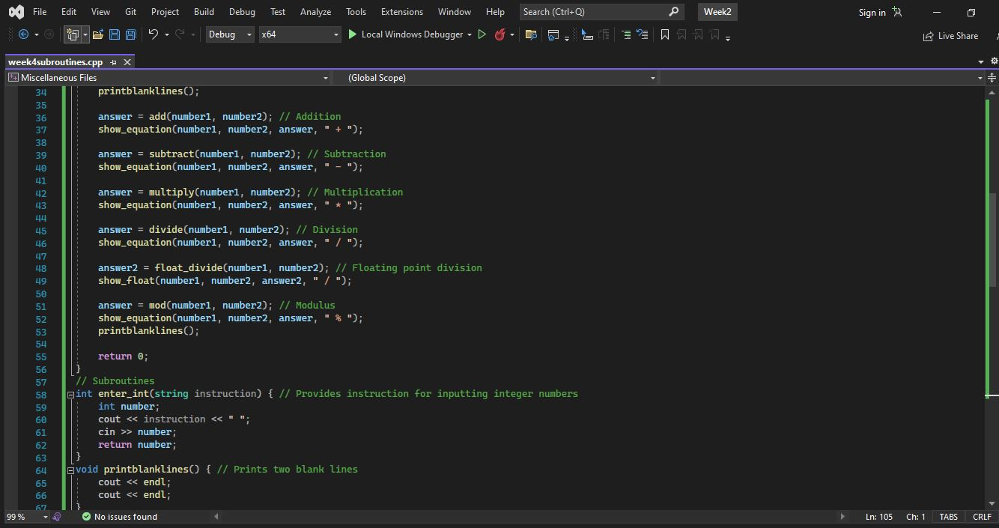
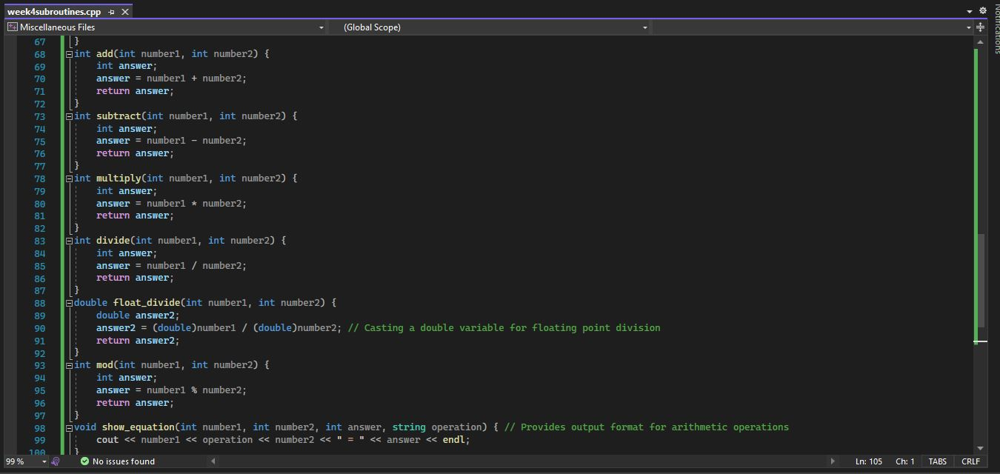
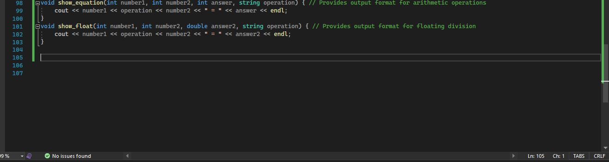
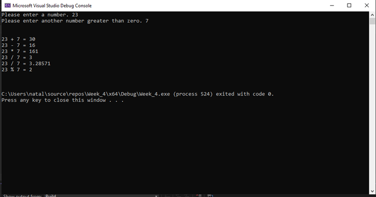

# Week 4 Subroutines Program

This week's program expanded on the simple calculator program created in Week 2, by adding subroutines functions.
* Demonstration of code

* Output when successfully running the code and inputting two integers

