# Week 6 Selection Program

For this week's project, selection statements were added to both the tic-tac-toe program and calculator. These selection statements are for the purpose of providing error checking and preventing the user from inputting incorrect values, as defined by parameters. These selection statements were added to the subroutines and written in the form of if-else statements. The tic-tac-toe board was also expanded to add rounds where each player takes a turn to play.

# Tic Tac Toe code

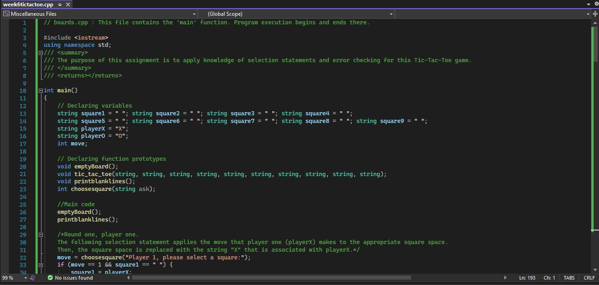
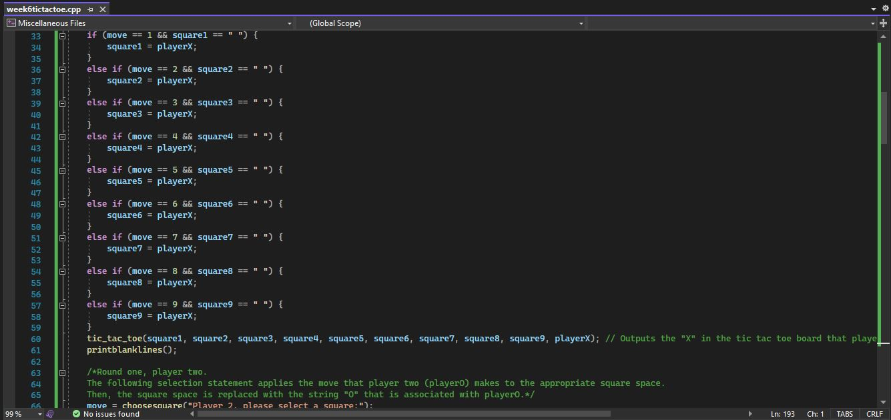
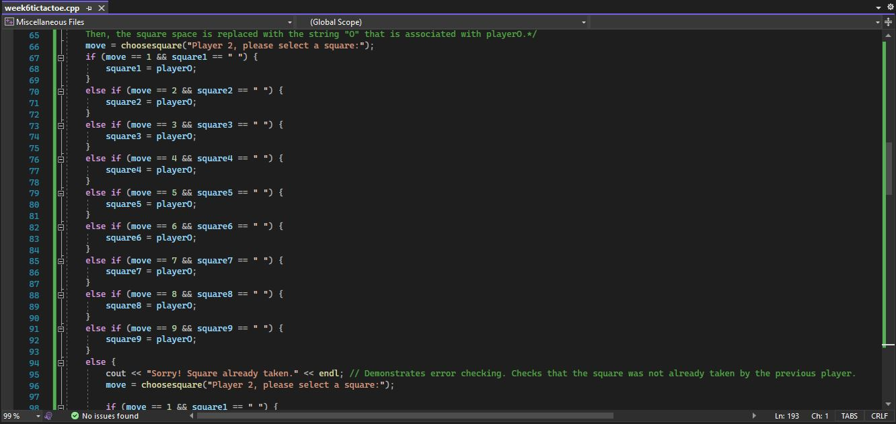
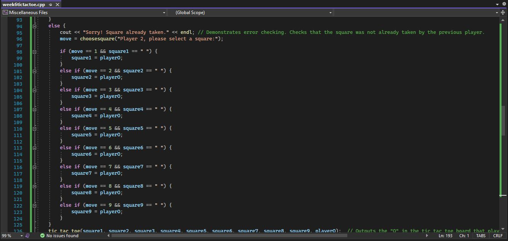
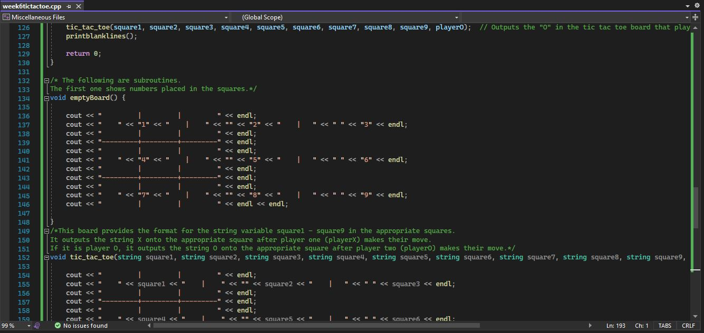
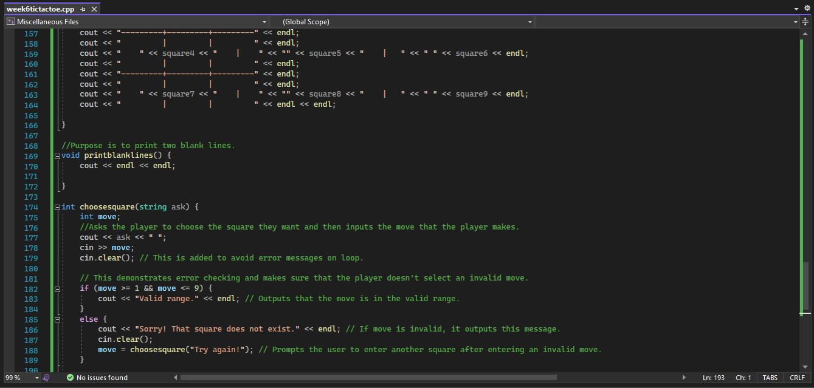
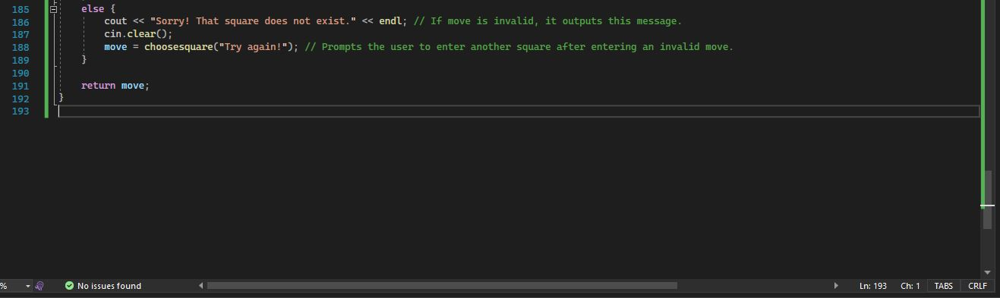
* The following images demonstrate running the code successfully. An X or O is placed when Player 1 and Player 2 chooses a spot on the board. It also demonstrates error checking and prevents the player from choosing a spot that does not exist on the board.
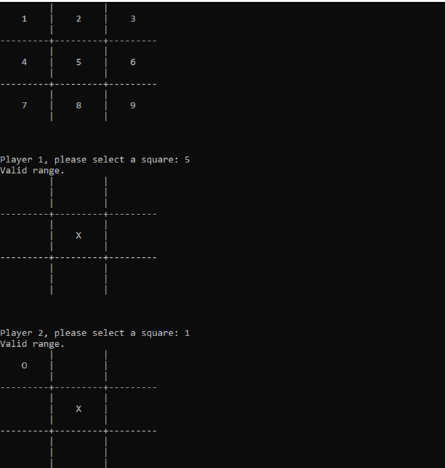
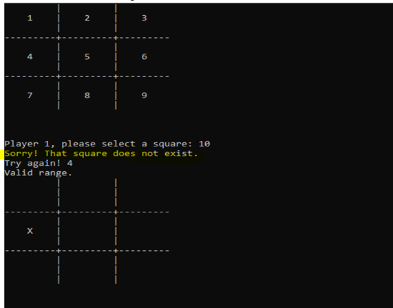
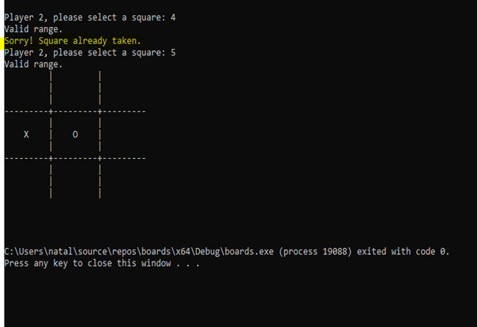

# Calculator code

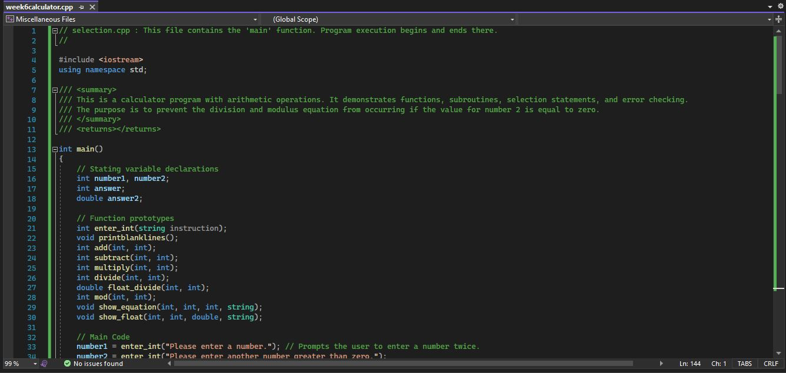
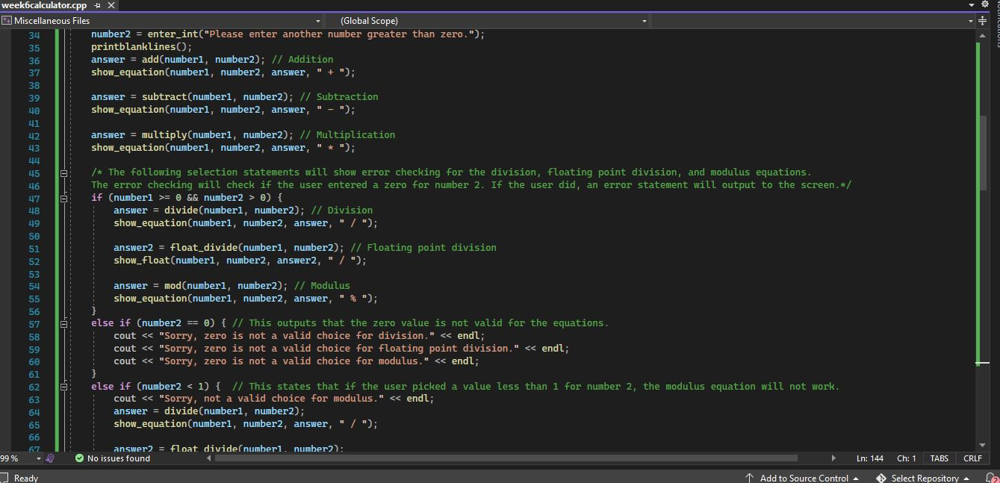
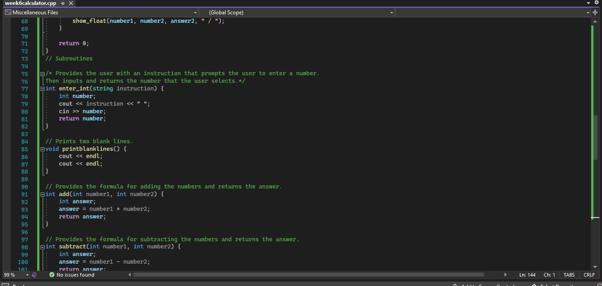
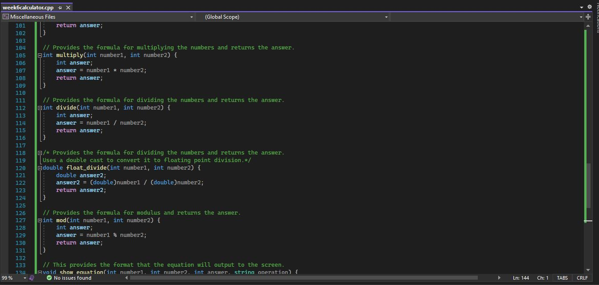
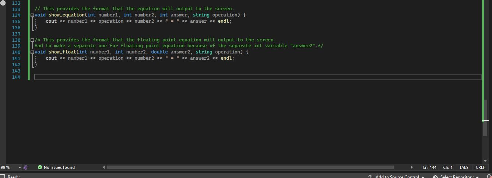
* The following images shows the code running successfully. It uses selection statements that provide error checking, and prevents the values of zero being inputted for the operations division, floating division, and modulus.
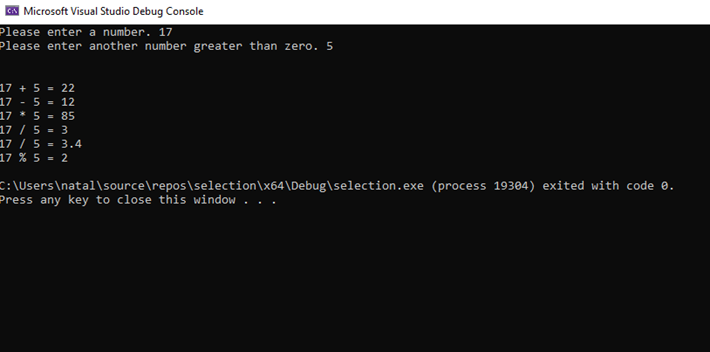
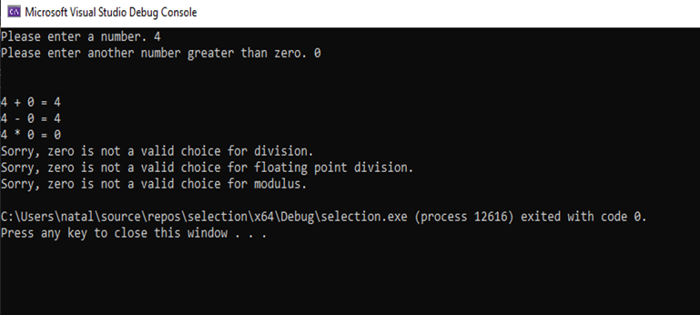

