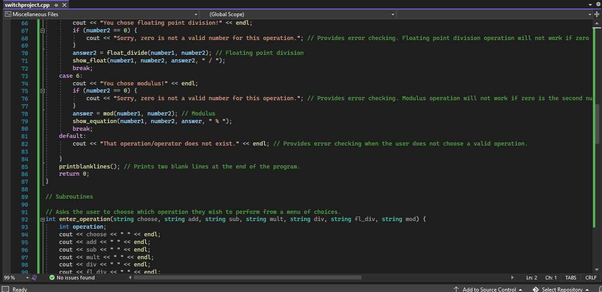

# Switch Program

This program added a switch function that asks the user which operation they would like to perform. It prompts the user to enter a number for each operation as a way to choose. It provides error checking to make sure the user does not select an option that isn't available.

* Code

* Output without Error Checking

*Output with Error Checking

